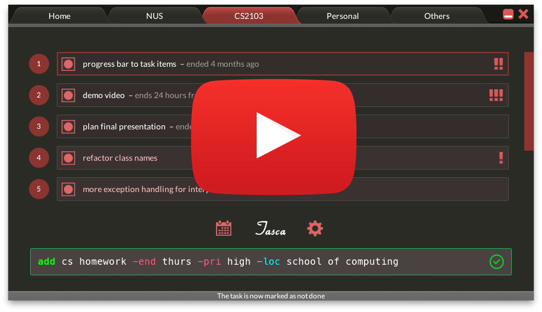

TASCA
=====

<p align="middle">
    <a href="http://www.youtube.com/watch?feature=player_embedded&v=Et2IpO6p-xw
    " target="_blank"></a>
</p>


A todo manager with the agility of command-line and the simplicity of a smart GUI.

## Usage

Clone:
```bash
$ git clone https://github.com/MohitShridhar/TASCA.git
```

Launch: `executables/app/Tasca.jar`

## Guide

See [user's manual](guides/user_guide.pdf).

## Documentation

See [developer's guide](guides/developers_guide.pdf)

## Contributors

**NUS CS2103** (Software Engineering):

Narinderpal Singh Dhillon (Deadlines & Integration)
Nigel Cheok Jianxing (Documentation & Testing) 
Wu Haoyang (Testing & Deliverables)
Mohit Shridhar (Team Lead, Scheduling, Deliverables & Code quality)  

Semester 2 (AY2013/2014) 
